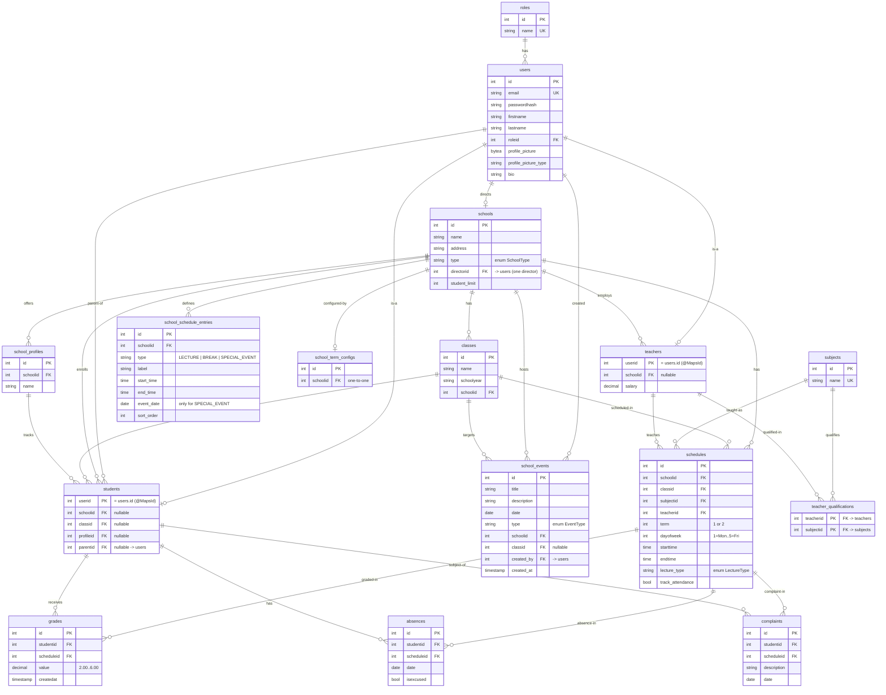

# EduTrack — Entity Relationship Diagram

> Source of truth: the JPA entities in
> `backend/e-journal/src/main/java/com/edutrack/edutrack/entity/`.
> Tables are generated by Hibernate (`spring.jpa.hibernate.ddl-auto=update`);
> `sql/create-tables.sql` is **deprecated** and slightly out of date.

## Notes

- **`teachers` / `students` share their PK with `users`** via JPA `@MapsId`
  (`userid` is both PK and FK → `users.id`). They are "is-a" extensions of a user.
- **`users.parentid`**: a STUDENT row points to a parent **user** (not a separate
  parents table) through `students.parentid`.
- **`schools.directorid`** is the headmaster (a `users` row); one-to-one.
- **`teacher_qualifications`** is the join table for the many-to-many between
  `teachers` and `subjects`.
- A `schedule` is the central link: `grades`, `absences`, and `complaints` all
  reference both a `student` and a `schedule`.
